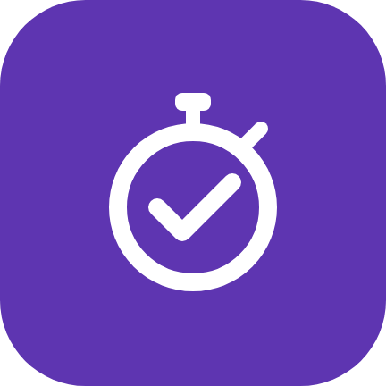
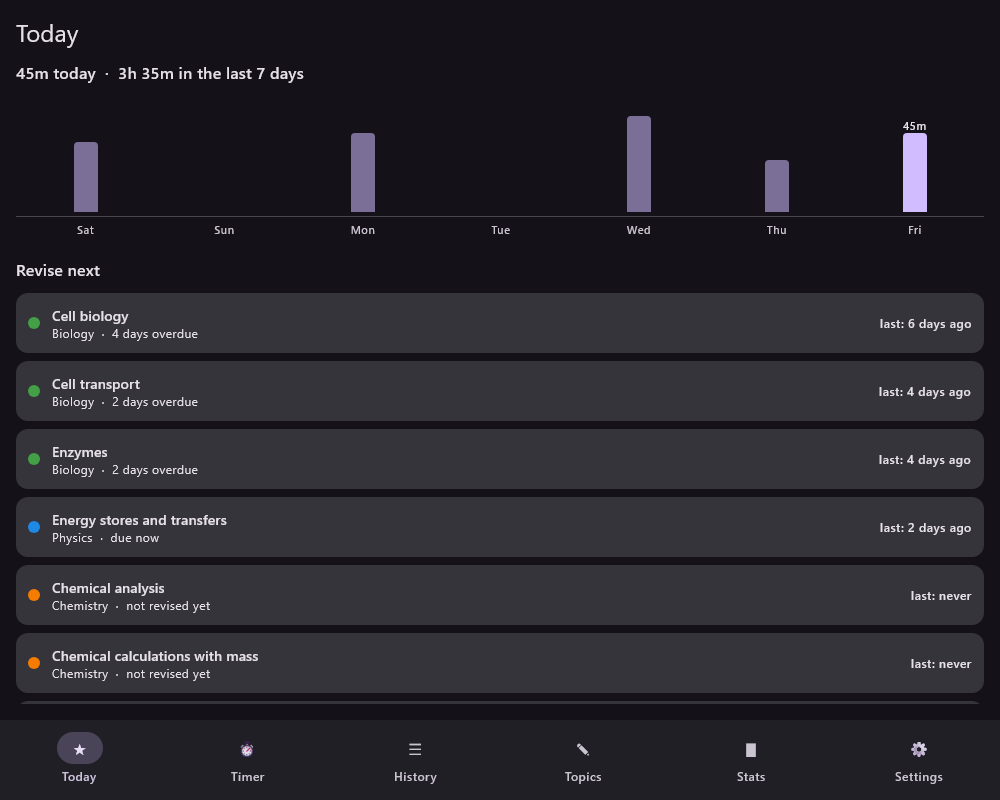
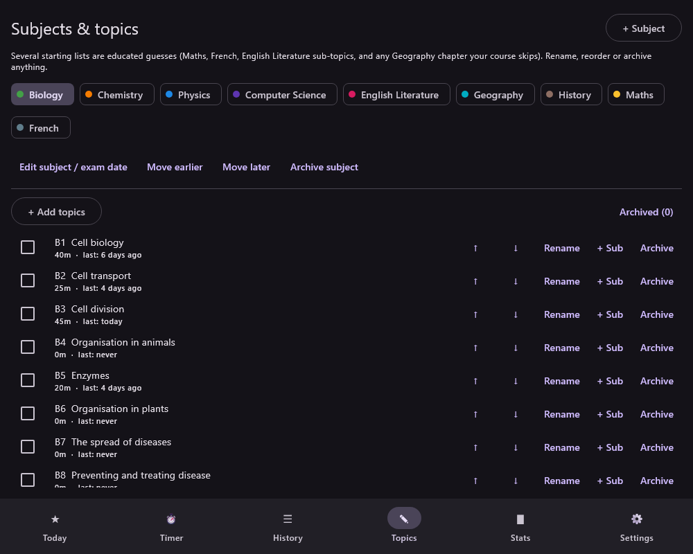
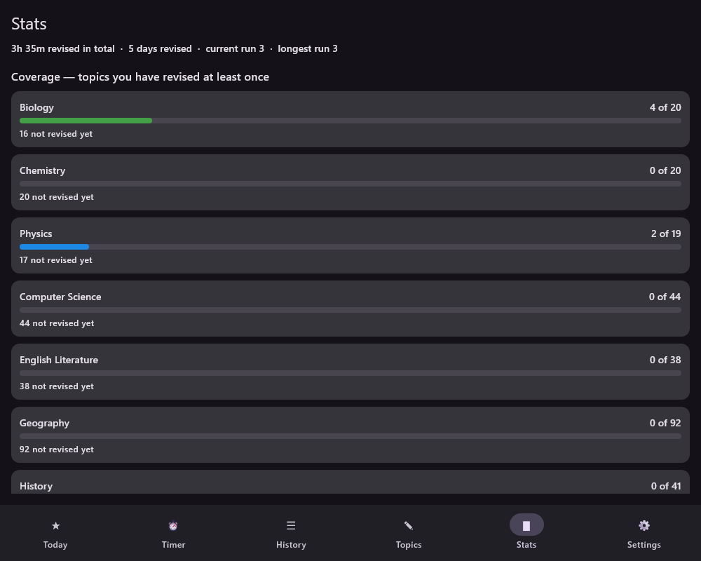
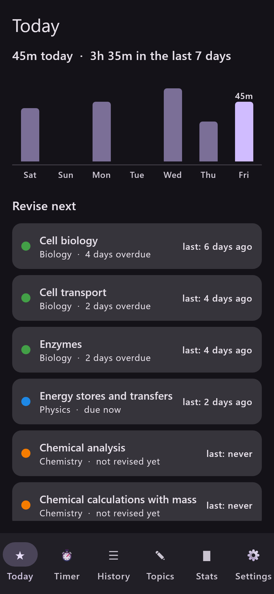

<div align="center">


# Revision Tracker

**Log your GCSE revision with a live timer, see where your time actually goes,
and get told what to revise next.**

Windows desktop and Android, from one Kotlin codebase. No account, no server —
your data stays on your devices.

</div>



## What it does

- **Time your revision.** Start a session, pick several topics in a subject, and
  switch between them without stopping the clock. Pause and resume freely.
- **Never lose a session.** If the app or the PC dies mid-session, it offers to
  resume, save or discard on next launch — and never counts the hours the
  machine was asleep.
- **Get told what to revise.** A spaced-repetition score combines how overdue a
  topic is, topics you have never touched, how stale the others are, and how
  close the exam is. Each suggestion says *why* it is there ("9 days overdue").
  One tap starts revising it.
- **Log sessions you did away from the PC** after the fact.
- **See the totals** per subject and per topic, and how many topics you have
  never revised — usually the number worth acting on.
- **Sync your PC and phone** through a shared Google Drive or OneDrive folder
  (optional, off until you turn it on). No server and no sign-in of its own.
- **Start with your own subjects.** On first run you pick what you study and
  which board examines each one — AQA History alongside OCR Computer Science is
  normal — and the topic lists come from those boards' published
  specifications. Anything can be renamed, added, reordered or archived.

| Topics | Stats | Phone |
|---|---|---|
|  |  |  |

## Install it

### Windows

1. Download **`Revision.Tracker-<version>.msi`** from the
   [latest release](https://github.com/Enderben8/tracker/releases/latest).
2. Double-click it. It installs for your user only, so it needs no
   administrator password.
3. Open **Revision Tracker** from the Start Menu.

Java is bundled inside — nothing else to install. Your data lives in
`%LOCALAPPDATA%\RevisionTracker\revision.db` and survives upgrades and
uninstalls.

Windows SmartScreen may warn that the publisher is unknown, because the
installer is not signed with a paid certificate. *More info → Run anyway.*

### Android

1. Download **`RevisionTracker-<version>.apk`** from the same release, on the
   phone.
2. Open it and allow installing from this source when asked.

> The APKs built by GitHub are signed with a throwaway key, so Android will not
> install one *over* a copy you built yourself — uninstall the old one first,
> and **export a backup from Settings beforehand**, because uninstalling deletes
> its data. See [docs/NOTES.md](docs/NOTES.md) to set up a real signing key.

## Where the topics come from

The first time you open the app it asks which subjects you take and which board
examines each one, then installs those specifications' topic lists. Each list
says where it came from and when it was checked, e.g. *"AQA Biology 8461
specification, checked 20 Sep 2026"*.

Covered today — the board is chosen per subject, so any mixture works:

| Board | Subjects |
|---|---|
| **AQA** | Biology, Chemistry, Physics, Maths, Computer Science, English Literature, English Language, Geography, History, French, Religious Studies |
| **Edexcel** | Biology, Chemistry, Physics |
| **OCR** | Biology, Chemistry, Computer Science |

Anything not listed can be added as your own subject and filled in by hand, and
more boards are a data change rather than a code change — see
[docs/NOTES.md](docs/NOTES.md).

Specifications are written for teachers, so the wording is drier than a revision
guide's and some subjects include options your school does not take. Rename and
archive freely: Settings → *Restore topics from the specification* puts back
anything you archived, leaving your renames alone, and *Start over* returns you
to the subject picker while keeping your logged hours.

## Build it yourself

You need **JDK 17 or newer** (21 recommended) and, for the Android app, the
Android SDK. Everything else — Gradle, Kotlin, Compose — downloads on the first
build.

```bash
git clone https://github.com/Enderben8/tracker.git
cd tracker

./gradlew :composeApp:run              # run the desktop app from source
./gradlew :composeApp:packageMsi       # build the Windows installer
./gradlew :androidApp:assembleDebug    # build an APK
./gradlew :core:desktopTest :composeApp:desktopTest   # run the tests
```

On Windows, `scripts\install-desktop.bat` does the build-and-install in one
double-click, and `scripts\run-dev.bat` runs it from source.

For Android, point Gradle at your SDK by creating `local.properties`:

```properties
sdk.dir=C:/Users/you/AppData/Local/Android/Sdk
```

## How it is built

| | |
|---|---|
| Language | Kotlin Multiplatform |
| UI | Compose Multiplatform (Material 3), shared by both platforms |
| Database | SQLDelight over SQLite, local to each device |
| Modules | `core` (data, scheduler, sync — no UI, and unit-tested), `composeApp` (all screens), `androidApp` (Android entry point) |

`docs/PROJECT_SPEC.md` is the full brief: schema, the scheduling algorithm, the
sync design and the reasoning behind each decision. `docs/NOTES.md` covers
decisions taken while building it and the known rough edges.

## Licence

[MIT](LICENSE).
